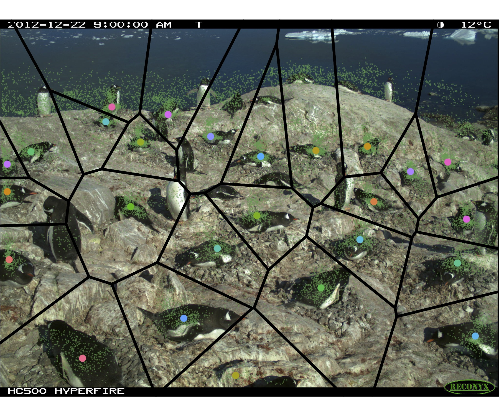

# Old penguin watch camera data processing
Penguin Watch camera processing - Summer 2016

Most scripts in various stages of completion.

`Scripts/Methods_script.R` contains code to create time series from nests. It orthorectifies images, filters based on click density, and defines nests using K-means. Slow to run, K (# nests) needs to be given, and parameters need to be tweaked for each site. Data plotted below, with colored dotes over each nest (determined via K-means). Green dots represent all clicks. Black lines represent 'nest zones'.

